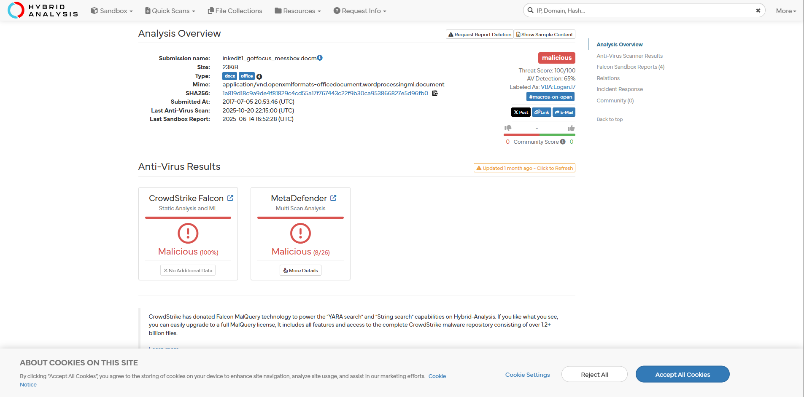
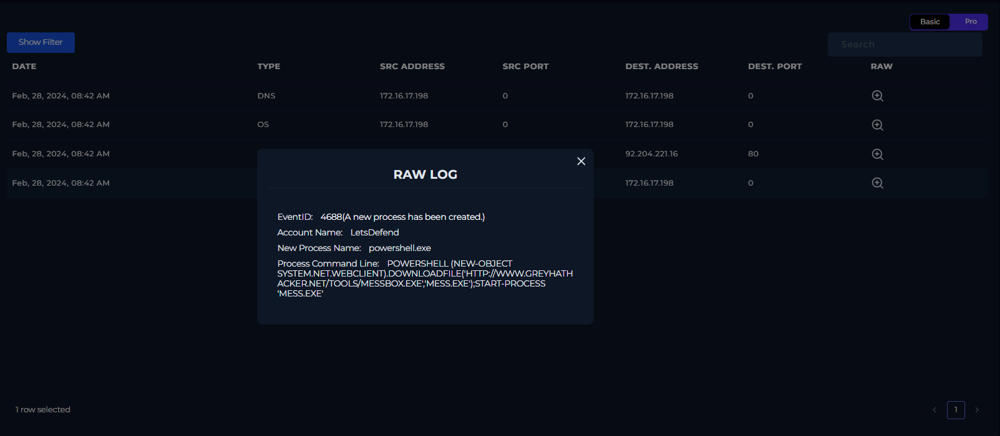
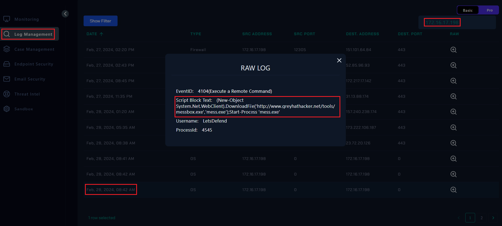
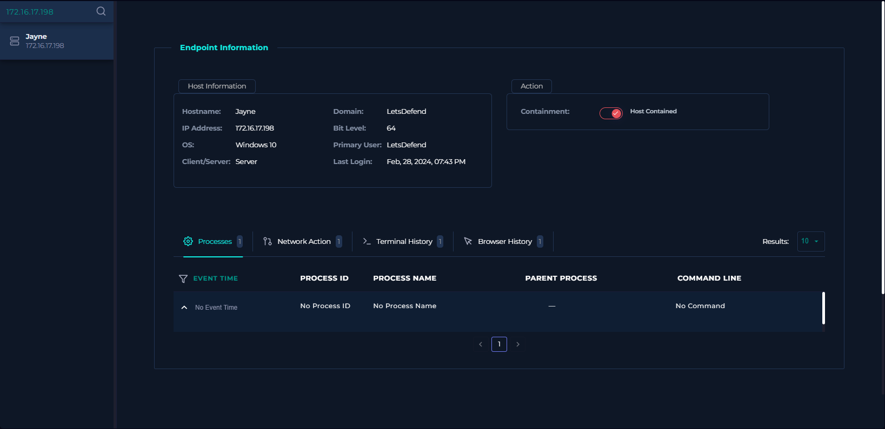

# 🛡️ Walkthrough: SOC205 - Malicious Macro Execution (EventID: 231)

| **Alert ID** | **Scenario** | **Date** | **Difficulty** | **My Verdict** |
|:------------:|:------------:|:--------:|:--------------:|:--------------:|
| SOC205       | Malicious Macro has been executed | Feb 28, 2024 | Medium | **True Positive** |

---

## 📝 Executive Summary
Case number 231 was received for review. The log indicates that a rule was triggered due to a malicious file being executed. A file named **“edit1-invoice.docm”**, resembling an MSWord file, was downloaded to the device.

When the hash value was queried on the **hybrid-analysis.com** website, it was flagged as malicious. Upon further investigation of the logs, it was observed that a code was executed by making a request to the IP address **92.204.221.16** via `http://www.greyhathacker.net/tools/messbox.exe`.

When the device's logs were examined, **no records were found**, suggesting that the software may have deleted all logs. The device was therefore isolated from the network.

---

## 🔍 Investigation Process

### 1. Initial Analysis
I started by examining the alert details to identify the suspicious file.
* **File Name:** `edit1-invoice.docm`
* **Path:** `Downloads` folder
* **Trigger Reason:** Suspicious file detected on system.

> **Observation:** The file extension `.docm` indicates a Word document with macros, which is a common vector for malware.

### 2. Malware Analysis
As mentioned in the summary, I queried the file hash on **Hybrid-Analysis**.
* **Result:** The file is confirmed as **Malicious**.
* **Behavior:** It executes a VBA macro to download a payload from an external source.

> **Screenshot:**
> 
> *Caption: Hybrid-Analysis report confirming the malicious nature of the file.*
> 
> *Caption: VirusTotal-Analysis report confirming the malicious nature of the file.*

### 3. Network Execution
I checked the logs to trace the activity of the malicious file. I found that the macro executed a command to connect to a C2 server.
* **Destination IP:** `92.204.221.16`
* **Malicious URL:** `http://www.greyhathacker.net/tools/messbox.exe`
* **Payload:** `messbox.exe`

> **Screenshot:**
> 
> *Caption: The malicious command initiating the download.*
> 
> *Caption: The HTTP GET request confirming the connection to 92.204.221.16.*

### 4. Anti-Forensics (Log Wiping)
During the endpoint investigation on the device, I looked for process logs to see the execution of `messbox.exe`. However, I encountered a critical finding:
* **Finding:** **"No records found"**
* **Conclusion:** The malware or attacker deleted the system logs to hide their tracks (Defense Evasion).

> **Screenshot:**
> 

---

## 🧬 Artifacts (IOCs)

| Type | Value | Description |
| :--- | :--- | :--- |
| **C2 IP** | `92.204.221.16` | Attacker Server |
| **URL** | `http://www.greyhathacker.net/tools/messbox.exe` | Payload Download Link |
| **File Name** | `edit1-invoice.docm` | Malicious Word Doc |
| **Payload** | `messbox.exe` | Dropped Malware |

---

## 🎯 Conclusion & Remediation

**Verdict:** **True Positive**

The device was compromised via a malicious macro which downloaded a payload and performed log wiping.

**Actions Taken:**
1.  **Isolation:** The device was isolated from the network.
2.  **Blocking:** The malicious IP and URL were blocked.
3.  **Recovery:** Since the logs were deleted, I recommended **reinstalling the OS (Re-image)** to ensure the system is fully clean.

---
*Investigated by Mehmet Talha Gönen*
